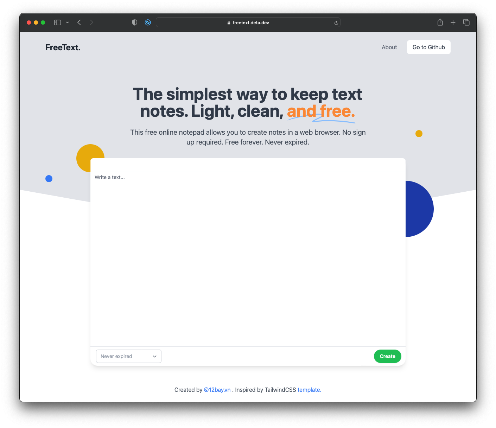

# FREE TEXT APP

> The simplest way to keep text notes. Light, clean, and free.  
> No Ads, no sign up, no monitoring, nothing. Free forever. Never expired.  
> https://freetext.deta.dev



The app targets modern browsers. Using JavaScript modules and ES6 features and more.

## API

### Create a Note

```bash
$ curl -X POST https://freetext.deta.dev \
-H 'Content-Type: text/plain' \
-d 'Your text content'
```

### Get a Note

```bash
$ curl https://freetext.deta.dev/<key>
```

with raw only

```bash
$ curl https://freetext.deta.dev/<key>/raw
```

### Format output type

```bash
$ curl https://freetext.deta.dev/<key>.html
```

Examples HTML output type

[https://freetext.deta.dev/christmas.html](https://freetext.deta.dev/christmas.html)  
[https://freetext.deta.dev/myheart.html](https://freetext.deta.dev/myheart.html)

## License

MIT
